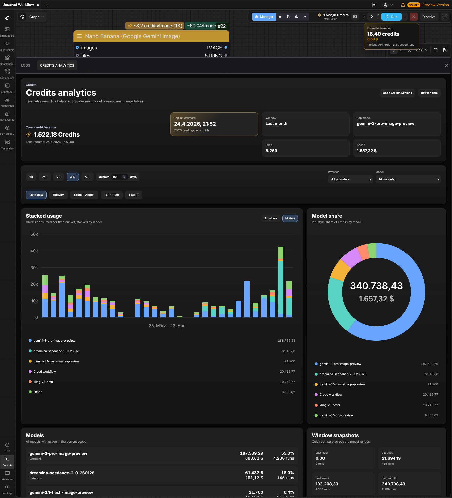

 <h1> 

  
 Comfyui API-utils</h1>

  
 

 

Enhanced Comfy-Credits analytics, display, CSV export, aswell as USD conversion/display.

> [!IMPORTANT]
> Credit and USD numbers are estimates, not official billing records.
>Some Comfy API billing events do not expose raw credit values in a directly readable form. For those events this extension estimates credits from current or known price tables and token/count/duration metadata. These numbers are not completely exact and can deviate by up to   10% for some nodes.

## Features

- Customizable Top-bar credits widget with current balance, USD value and burn-rate.
- Hover estimate on the Run button with current workflow credits and USD cost, multiplied by the queued run count.
- Auto-refresh while ComfyUI is visible.
- USD cost estimation on API nodes.
- Bottom-panel `Credits Analytics` tab.
- `Overview` tab with usage charts, balance, top model, run count, and spend.
- `Activity` tab with all billable calls with proper navigation.
- `Credits Added` tab with Top-up events.
- `Burn Rate` tab with customisable burn-rate and top-up estimation.
- `Export` tab with configurable CSV export of all data.
- Settings toggles for:
  - credits widget
  - estimated USD badges on API nodes
  - run button cost estimate
  - widget refresh button
  - burn rate widget
- No extra Python dependencies needed.

## UI screenshot
<h1> 

## Pricing Estimates

- Uses the current Comfy UI conversion ratio: `211 credits = $1`.
- Uses raw billing events when Comfy exposes usable credit or USD values.
- When raw credit values cannot be read, credits are estimated from available price, token count, duration, endpoint, model, and provider metadata.
- Estimation is calculated on offical comfyui pricing from docs https://docs.comfy.org/tutorials/partner-nodes/pricing

## Accuracy Disclaimer

Credit and USD numbers are estimates, not official billing records.

Some Comfy API billing events do not expose raw credit values in a directly readable form. For those events this extension estimates credits from current or known price tables and token/count/duration metadata. These numbers are not completely exact and can deviate by around 10% for some nodes.

Deviations are more likely when API prices changed over time, especially when a model or provider became cheaper after older runs. The extension does not have historical API pricing data, so older events may be recalculated with newer assumptions.

For exact billing, use Comfy's official credits and billing pages.

## Install

1. git clone or copy folder into `ComfyUI/custom_nodes`.
2. Restart ComfyUI.
3. Sign in to your Comfy account in `Settings > User`.
4. Open the analytics panel from the top-bar widget or `Extensions > Credits Analytics`.

## Notes

- This extension reads Comfy billing/account endpoints already used by the official UI.
- API node USD badges are only shown for API nodes that already expose a Comfy credits price badge.
- The extension is frontend-only: `__init__.py` only registers the `web/` directory.
